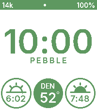

# Percival

  <!-- mini: none/year/none · bottom: none/weather/none · color: black · weather: NY 21° · year: 1999 -->
  &nbsp;&nbsp;&nbsp;&nbsp;
  <!-- mini: date/month/battery · bottom: high-low/weather/sunset · color: GColorPurpureus · weather: DC 58° hi63 lo47 · sunset: 7:42 · date: Sun 5 -->
  &nbsp;&nbsp;&nbsp;&nbsp;
  <!-- mini: date/none/battery · bottom: high-low/steps/weather · color: 0xFF5500 · weather: SF 78° hi82 lo68 · steps: 77k -->
  &nbsp;&nbsp;&nbsp;&nbsp;
  <!-- mini: date/week/battery · bottom: high-low/week/uv · color: GColorPictonBlue · weather: LA 78° hi82 lo65 · uv: 6 · week: 15 -->
  &nbsp;&nbsp;&nbsp;&nbsp;
  <!-- mini: steps/none/battery · bottom: sunrise/weather/sunset · color: GColorIslamicGreen · weather: DEN 52° hi58 lo41 · sunrise: 6:02 · sunset: 7:48 · steps: 14k -->
  

A proud Pebble watchface with primary and accent complications.

- **Primary Complications:** Current weather, daily high/low temps, sunrise time, sunset time, step count, week number, or UV index.
- **Accent Complications:** Date, steps, battery, sunrise, sunset, year, month, week number, or UV index

Color and complications are configurable through settings on the Pebble app.
