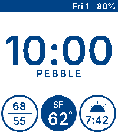
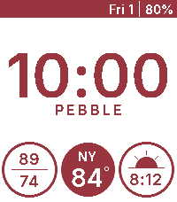

# Percival

  &nbsp;&nbsp;&nbsp;&nbsp;
  &nbsp;&nbsp;&nbsp;&nbsp;
  

A weather-focused Pebble watchface. Three location aware complications show:
- Current temperature
- Daily high/low
- Sunset time

Weather data is pulled from the Open-Meteo API every 30 minutes. Location is resolved through GPS coordinates via BigDataCloud. Cached when location changes less than 1km.

Color is configurable through settings.
